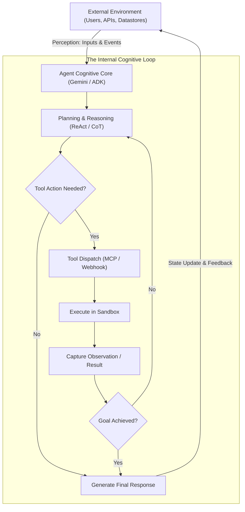

# 📘 Module 1: Introduction to Agents on Google Cloud
**Course:** Understand Google Cloud Agents (Course 1504)  
**Track:** Google Cloud Certified Professional Agentic Architect (Path 4525)  
**Enterprise Reference:** *Cymbal Labs*  
**Document Revision:** 1.0.0

---

## 01. Course Introduction: The Age of the Agentic Architect

In cloud computing, architecture paradigms shift once every decade:
1. **2000s:** Bare-Metal Servers $\rightarrow$ Virtual Machines (IaaS)
2. **2010s:** Microservices, Containers & Kubernetes (Cloud Native)
3. **2020s:** Predictive ML $\rightarrow$ Generative AI (LLMs)
4. **Current Era (2025+): Autonomous Agentic Systems**

A **Google Cloud Professional Agentic Architect** does not just build prompts; they design **autonomous cognitive distributed systems**. The goal is transforming large language models from passive text generators into proactive, goal-directed systems capable of interacting with enterprise databases, APIs, code repositories, and human colleagues.

---

## 02. The Cymbal Labs Enterprise Use Case

Throughout Google Cloud's official curriculum, scenarios are contextualized around **Cymbal Labs**:

```
                                  ┌───────────────────────────┐
                                  │   CYMBAL LABS ENTERPRISE  │
                                  └─────────────┬─────────────┘
                                                │
         ┌──────────────────────────────┬───────┴──────────────────────┬──────────────────────────────┐
         ▼                              ▼                              ▼                              ▼
  [Fragmented Data]             [Customer Support]             [Internal IT Desk]             [Software Engineering]
  • 10+ Legacy Databases        • 10,000+ daily tickets        • Slow laptop/access           • Manual CI/CD approvals
  • Unstructured PDF manuals    • High churn & wait times      • Repetitive tier-1 FAQs       • Inconsistent test runs
  • Cloud SQL + BigQuery silos  • Brittle legacy RPA bots      • Siloed Confluence/Drive      • Slow incident triage
```

### Why Traditional Solutions Failed Cymbal Labs:
1. **Static RPA (Robotic Process Automation):** Breaks the moment a web page changes by 1 pixel or an API response schema updates.
2. **First-Gen Chatbots:** Regurgitated pre-written scripts. When users had complex, multi-variable problems, the bots hit deadlocks.
3. **Naive RAG (Retrieval-Augmented Generation):** Answered questions about policy, but could not *execute* actions (e.g., could explain how to issue a refund, but could not actually call the billing API to process it).

**The Solution:** An integrated agentic ecosystem using Google Cloud's Agent Platform, CX Studio, and Agent Development Kit (ADK) that connects perception to autonomous tool action.

---

## 03. Module Overview: Foundational Agency

This module establishes the foundational vocabulary, cognitive models, and system boundaries:
* Distinguishing **chatbots** from **agents**.
* The **4 Core Capabilities**: Perception, Planning, Action, and Memory.
* The **Cognitive Control Loop** (Perceive-Plan-Act-Reflect).
* Google Cloud's product taxonomy for agent creation.

---

## 04. Introduction to AI Agents: The Agency Continuum

| Dimension | Predictive ML (e.g., XGBoost) | Generative Chatbot (e.g., Basic Gemini) | Autonomous AI Agent (e.g., MAS / Google ADK) |
|---|---|---|---|
| **Primary Task** | Classification or Regression | Text completion & dialogue | Autonomous goal attainment |
| **Execution Loop** | Single-shot computation | Single turn request/response | Iterative loop: Perceive $\rightarrow$ Plan $\rightarrow$ Act $\rightarrow$ Verify |
| **Tool Usage** | None | Read-only static search (RAG) | Full read/write API execution & state changes |
| **Error Handling** | Loss function minimization | Apologizes or hallucinates | **Self-Correction & Reflexion** (retries with new plan) |
| **State Awareness**| None | Ephemeral session context | **Dual-Tier Memory** (Short-term working + Long-term episodic) |

---

## 05. AI Agent Core Capabilities (The 4 Pillars)

Every enterprise agent—whether low-code in CX Studio or pro-code in ADK—is constructed from four pillars:

```
                      ┌────────────────────────────────────────────────────────┐
                      │                   THE 4 PILLARS OF AGENCY              │
                      └───────────────────────────┬────────────────────────────┘
                                                  │
         ┌────────────────────────┬───────────────┴───────────────┬────────────────────────┐
         ▼                        ▼                               ▼                        ▼
  1. PERCEPTION            2. PLANNING                     3. TOOL ACTION           4. MEMORY
  • Multimodal inputs      • Task decomposition            • API / Webhooks         • Working Memory
  • Intent classification  • Chain-of-Thought (CoT)        • Database queries       • Episodic Memory
  • Entity extraction      • ReAct reasoning loops         • CLI execution          • Vector Search
  • Environment sensing    • Failure re-planning           • Protocol adapters      • Session state
```

### 1. Perception
How the agent senses its environment. In Google Cloud, this includes:
* **Natural Language Text:** Client briefs, chat inputs, customer complaints.
* **Multimodal Sensory Streams:** Screenshots (via Playwright/Chrome), scanned PDFs, audio voice calls, and video diagnostic feeds.
* **Structured Payload Data:** Webhook alerts, JSON event bus payloads, database trigger events.

### 2. Planning
The cognitive brain. The model breaks high-level goals into executable sub-tasks:
* **Decomposition:** Splitting *"Build and deploy a double-entry ledger"* into *Design Schema* $\rightarrow$ *Write Unit Tests* $\rightarrow$ *Implement Hash Chain* $\rightarrow$ *Run Regression Gate*.
* **ReAct Pattern (Reasoning + Acting):** Generating an explicit thought before taking an action:  
  $$\text{Thought} \longrightarrow \text{Action} \longrightarrow \text{Observation} \longrightarrow \text{Next Thought}$$
* **Self-Reflection & Reflexion:** When an action fails, generating an automated critique to alter the subsequent plan.

### 3. Tool Action
How the agent affects the world. Without tools, an LLM is a brain in a jar:
* **Enterprise APIs:** REST/gRPC endpoints (e.g., Salesforce, ServiceNow, SAP, BigQuery).
* **System Execution:** Git branch creation, test execution, container sandboxing (`bwrap`).
* **Protocols:** **Model Context Protocol (MCP)** and **Agent2Agent (A2A)** for cross-agent tool sharing.

### 4. Memory
Context preservation across operational timelines:
* **Working Memory:** The active context window. Managed with sliding-window FIFO eviction and pinned system instructions.
* **Episodic Memory:** Long-term vector persistence storing past trajectories, successful strategies, and failure post-mortems for $k$-NN semantic retrieval.

---

## 06. The Foundational Agent Architecture

The fundamental control loop executed by every Google Cloud agent:



---

## 07. Enterprise Use Cases for AI Agents

Google Cloud categorizes agent use cases into three maturity tiers:

1. **Information & Knowledge Concierge (Retrieval-Centric):**
   * Unifying fragmented documentation across BigQuery, Google Drive, and Cloud SQL using **Agent Search** and the **Gemini Enterprise App**.
2. **Customer Experience & Interaction (State-Centric):**
   * Multi-turn customer onboarding, claims processing, and technical support using **CX Agent Studio** with deterministic state machines and event handlers.
3. **Autonomous Operations & Software Engineering (Action-Centric):**
   * Self-healing CI/CD pipelines, automated vulnerability remediation, and multi-agent software engineering using the **Agent Development Kit (ADK)** and **Antigravity**.

---

## 08. Developing Agents with Google Cloud (The Ecosystem Map)

```
┌────────────────────────────────────────────────────────────────────────────────────────┐
│                          GOOGLE CLOUD AGENTIC ECOSYSTEM                                │
├────────────────────────────────────────────────────────────────────────────────────────┤
│  LOW-CODE / BUSINESS CONSUMPTION                                                       │
│  • Gemini Enterprise App (Workspace search, knowledge synthesis)                       │
│  • Customer Experience (CX) Agent Studio (Visual state machines, flows, pages)         │
├────────────────────────────────────────────────────────────────────────────────────────┤
│  PRO-CODE / DEVELOPER FRAMEWORKS                                                       │
│  • Agent Development Kit (ADK) (Python/TypeScript multi-agent orchestration)           │
│  • Antigravity (Advanced agentic coding IDE, rules, skills, subagent workflows)        │
│  • Agent Runtime (Managed containerized execution environment for agents)              │
├────────────────────────────────────────────────────────────────────────────────────────┤
│  DATA, RETRIEVAL & VECTOR MEMORY                                                       │
│  • Vertex AI Agent Search (Formerly Vertex AI Search - structured/unstructured RAG)    │
│  • Vertex AI Vector Search 1.0 (Billion-scale vector indexing, Annoy / ScaNN algorithms)│
│  • BigQuery & Cloud SQL Connectors (Direct relational data grounding)                  │
├────────────────────────────────────────────────────────────────────────────────────────┤
│  SECURITY, GOVERNANCE & PROTOCOLS                                                      │
│  • Agent Identity & Principal Access Boundaries (PAB)                                  │
│  • Model Armor (Prompt injection defense, jailbreak detection, sensitive data masks)   │
│  • Model Context Protocol (MCP) & Agent2Agent (A2A) standards                          │
└────────────────────────────────────────────────────────────────────────────────────────┘
```

---

## 09. 📝 Quiz: Introduction to Agents on Google Cloud

Test your comprehension against these 5 scenario questions modeled directly on the official Google Cloud certification exam format.

---

### Question 1 (Core Capabilities)
**Scenario:**  
Cymbal Labs wants to automate their internal software release qualification process. Their legacy system consists of an LLM that reads release notes and generates a summary email. The VP of Engineering complains that the system is not truly "agentic" because it cannot verify test results or deploy builds.

**Question:**  
Which combination of capabilities must be added to transform this system into a true autonomous agent according to Google Cloud architectural standards?

* **A)** Increase the context window to 2 million tokens and provide few-shot prompt examples.
* **B)** Add Planning (ReAct loop), Tool Action (executing CI test verification APIs), and Memory (recording past deployment failures).
* **C)** Replace the foundation model with a smaller, faster model (SLM) running on Cloud Run.
* **D)** Connect the model to an external Vector Search index containing company HR policies.

---

### Question 2 (Perception & Grounding)
**Scenario:**  
Cymbal Labs' customer support team receives thousands of hardware return requests. Customers frequently submit photos of damaged equipment, PDF purchase receipts, and voice memos describing the failure.

**Question:**  
How should an Agentic Architect design the **Perception** layer to handle these incoming inputs effectively?

* **A)** Use an optical character recognition (OCR) script to convert everything to plain text before feeding it to a text-only LLM.
* **B)** Leverage Gemini’s native multimodal perception to ingest images, audio, and documents concurrently within the agent's context.
* **C)** Reject audio and image inputs and force customers to fill out a 15-field web form.
* **D)** Use a separate fine-tuned BERT model for each individual file format.

---

### Question 3 (Planning & Error Recovery)
**Scenario:**  
An agent at Cymbal Labs is tasked with provisioning a new staging environment on Google Kubernetes Engine (GKE). During execution, the tool call to allocate a subnet fails due to an IP address exhaustion error. 

**Question:**  
What distinguishes an **agentic architecture** from a traditional hardcoded procedural script when encountering this failure?

* **A)** The agent halts execution immediately, generates a stack trace, and terminates the pod.
* **B)** The agent retries the exact same API call 10,000 times in a tight loop.
* **C)** The agent captures the error as an environmental observation, reflects on the failure, alters its plan, and autonomously provisions an alternate available subnet or requests an IP range expansion.
* **D)** The agent ignores the error code and proceeds to deploy the application containers anyway.

---

### Question 4 (Tool Integration Protocols)
**Scenario:**  
Cymbal Labs wants their coding agents to securely access internal enterprise tools (such as database query tools, git repositories, and Jira ticket systems) across different programming environments without writing custom monolithic connectors for every tool.

**Question:**  
Which standard open protocol should the architect implement to standardize tool discovery, authentication, and invocation across agents?

* **A)** SOAP / XML-RPC
* **B)** Model Context Protocol (MCP)
* **C)** Telnet
* **D)** Simple Network Management Protocol (SNMP)

---

### Question 5 (Platform Selection)
**Scenario:**  
Cymbal Labs' business analysts want to create a customer-facing conversational agent that guides users through product returns using a visual interface with state-based flow diagrams, pre-built event handlers, and zero code.

**Question:**  
Which Google Cloud tool is specifically designed for this use case?

* **A)** Google Kubernetes Engine (GKE)
* **B)** Cloud Workstations
* **C)** Customer Experience (CX) Agent Studio / Gemini Enterprise Agent Designer
* **D)** BigQuery ML
